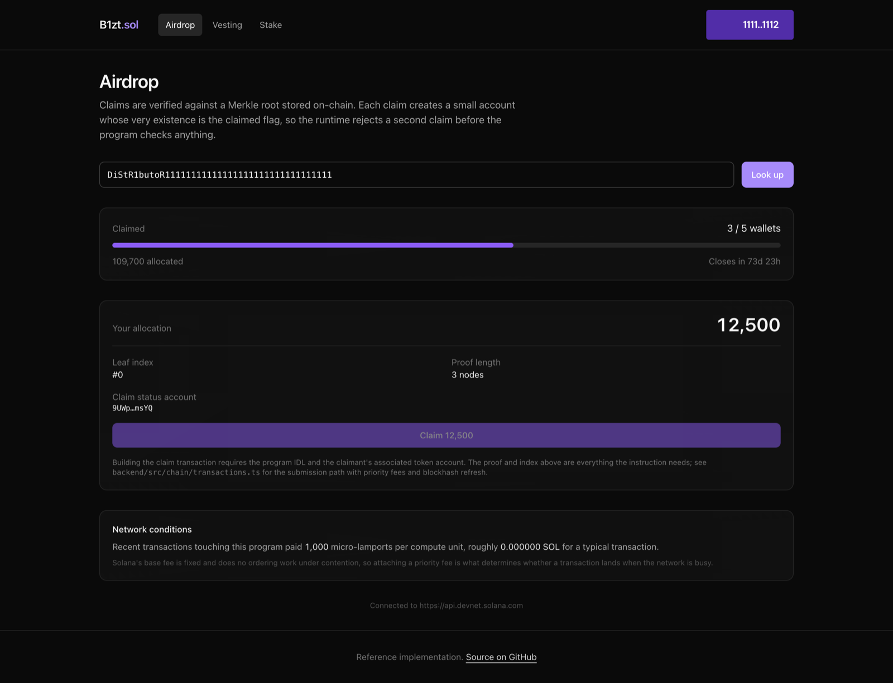
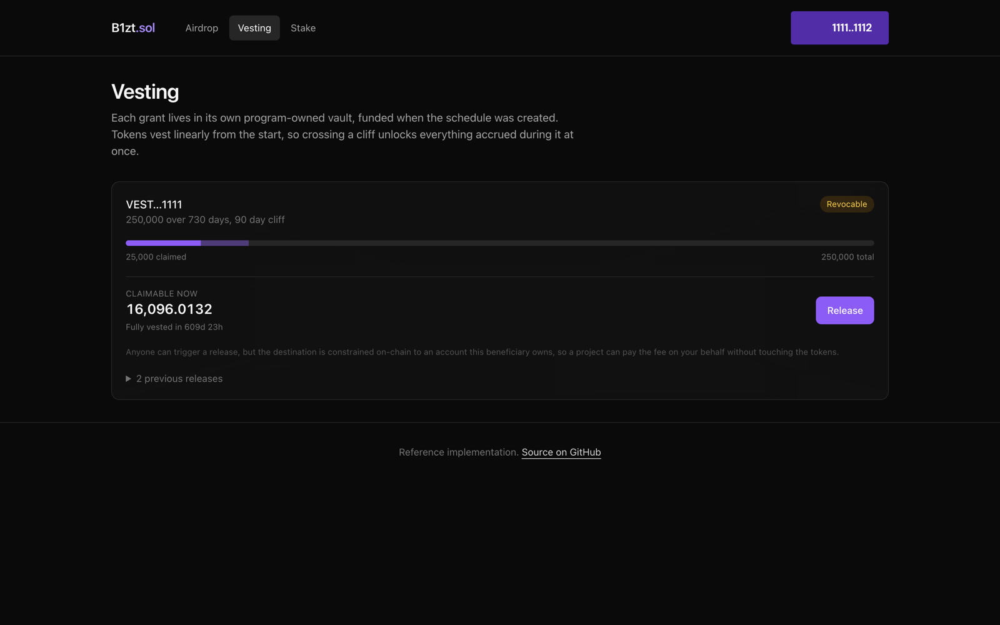
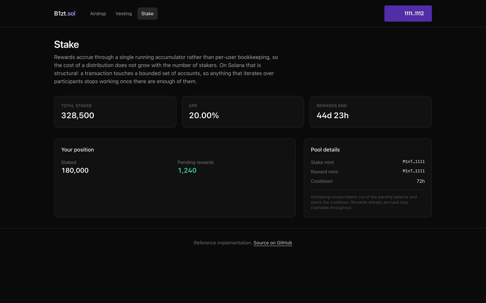

# SPL Token Platform

Everything a Solana project needs to launch and distribute a token: a capped mint, an airdrop people
can claim, team vesting with cliffs, and a staking pool that pays streamed rewards.

One Anchor program in Rust, a TypeScript API, and a Next.js frontend with wallet adapter.


---

## What you can do with it

**Claim an airdrop.** Eligibility is proved with a Merkle proof, so publishing an airdrop to 100,000
wallets costs one transaction. The page shows your allocation, your leaf index, the proof length and
the claim status account the program will create.



**Watch team tokens unlock.** Grants vest linearly with an optional cliff, and each grant lives in
its own program-owned vault, funded when the schedule was created.



**Stake for rewards.** Rewards accrue through a single running accumulator rather than per-user
bookkeeping. On Solana that is structural rather than an optimisation: a transaction touches a
bounded set of accounts, so anything that loops over participants stops working once the pool gets
popular.



---

## Run it yourself

You will need [Docker](https://docs.docker.com/get-docker/), [Node 20+](https://nodejs.org) and
[pnpm](https://pnpm.io/installation). Building the program additionally needs the
[Solana toolchain](https://solana.com/docs/intro/installation) and
[Anchor](https://www.anchor-lang.com/docs/installation), but you can run the app without it.

### 1. Start Postgres

```bash
docker compose up -d
```

Postgres lands on port 5436.

### 2. Start the backend

```bash
cd backend
cp .env.example .env
pnpm install
pnpm prisma db push         # create the tables
pnpm db:seed                # airdrop entries, vesting schedules and a stake pool
pnpm dev
```

The defaults point at Solana devnet, which needs no key and no funding. `pnpm db:seed` fills the
tables the indexer would normally build by reading program accounts, so the UI has something to show
without deploying anything.

### 3. Start the frontend

```bash
cd ../frontend
cp .env.example .env.local
pnpm install
pnpm dev
```

Open <http://localhost:3000> and connect a Solana wallet. The airdrop page asks for a distributor
address; the seed script prints one when it runs.

### 4. Optional: build and deploy the program

```bash
solana --version            # 3.x (Agave)
anchor --version            # 1.1.x

anchor build                # builds the program and generates the IDL
cargo test --workspace      # 32 tests

solana-test-validator       # or: anchor deploy --provider.cluster devnet
anchor deploy
```

Then put the printed program id into both `.env` files and set `INDEXER_ENABLED=true`, so the
backend reads real accounts instead of serving seeded ones.

### If something does not work

| Symptom | Cause |
|---|---|
| Pages are empty | You skipped `pnpm db:seed`. `curl localhost:4004/health` should return `{"status":"ok"}`. |
| Vesting and claim pages ask you to connect | They are per-wallet. The seeded grants belong to the demo wallets in `prisma/seed.ts`. |
| Backend exits at startup | It validates its whole environment at boot and names the variable at fault. |
| `anchor build` fails on Apple Silicon | Let Anchor manage the Solana version rather than mixing an installed one with `avm`. |

---

## Written for Solana, not translated from Ethereum

The most common failure in Solana code from EVM developers is a faithful translation of Ethereum
patterns the runtime does not reward. Four decisions here go the other way, and each is explained
where it appears in the code.

**PDAs replace privileged addresses.** The mint authority, every vault and every pool are
program-derived addresses. A PDA has no private key and can only sign through this program, so
authority is bounded by code rather than by key custody. There is no equivalent of "the owner key
was compromised".

**Account existence replaces boolean flags.** An airdrop claim is recorded by creating a PDA. The
runtime refuses to initialise the same address twice, so a replayed claim fails before the program
checks anything. Compare the EVM version in this portfolio, which packs a claim bitmap by hand: here
there is no flag to forget to set.

**Accumulators replace iteration.** Staking rewards use one running `reward_per_token` figure rather
than per-user bookkeeping.

**Constraints replace defensive code.** Most of the security lives in `#[derive(Accounts)]`:
`has_one`, `seeds`, `token::authority` and `address` are all checked before a handler runs. The
three classic Solana vulnerabilities, a missing signer check, a substituted account and an
unvalidated PDA, are closed declaratively rather than with runtime `if` statements.

---

## Decisions worth explaining

**The off-chain and on-chain Merkle trees are pinned to each other.** Both build from the same fixed
entry set and assert the same root, in
[`cross_check.rs`](programs/token_platform/tests/cross_check.rs) and
[`tree.test.ts`](backend/src/merkle/tree.test.ts). This matters more here than on the EVM: Rust's
`to_le_bytes` is **little-endian** while every EVM codebase is big-endian, so a tree builder ported
across without noticing produces well-formed proofs that fail every claim, and the on-chain error
says only `InvalidProof`. A dedicated test pins the encoding directly and asserts that big-endian
genuinely differs, so it cannot pass vacuously.

**Releasing vested tokens is permissionless but cannot be redirected.**
`token::authority = schedule.beneficiary` on the destination account is what makes that safe, so a
project can pay the fee for users who never claim without being able to move a single token
elsewhere. A litesvm test submits a well-formed release into an attacker's own account and it fails.

**Revocation pays out what was already earned first.** Vested but unclaimed tokens go to the
beneficiary in the same instruction, and only the remainder returns to the authority. Skipping that
step would let an authority time a revocation to confiscate earned tokens.

**Transaction submission handles the two things that actually go wrong on Solana.** A blockhash is
valid for about a minute, and an expired transaction cannot simply be resent because the blockhash is
part of what was signed. The sender rebuilds on every attempt with a fresh blockhash, and estimates a
priority fee from the 75th percentile of recent fees, because Solana's base fee is fixed and does no
ordering work under contention.

---

## Layout

```
programs/token_platform/
  src/state.rs                LaunchConfig, VestingSchedule, Distributor, StakePool
  src/instructions/           launch, vesting, airdrop, staking
  tests/logic.rs              22 pure-logic tests
  tests/integration.rs        6 litesvm tests against a real runtime
  tests/cross_check.rs        3 tests pinning the Merkle root
backend/
  src/merkle/                 Airdrop tree, the TypeScript half of the cross-check
  src/chain/transactions.ts   Blockhash refresh and priority fee estimation
  src/indexer/                getProgramAccounts with discriminator filters
  prisma/seed.ts              Sample data
frontend/                     Claim, vesting and staking
```

```bash
cargo test --workspace        # 32 Rust tests
cd backend && pnpm test       # 14 TypeScript tests
```

Properties worth calling out:

- `vesting_is_monotonic` - vesting never decreases across the whole schedule
- `large_grants_do_not_overflow` - and asserts the naive u64 form really would have overflowed
- `an_internal_node_cannot_pass_as_a_leaf` - the reason leaves are double hashed
- `a_late_staker_earns_nothing_from_before_they_joined` - the accumulator's core property
- `a_release_cannot_be_redirected_to_an_attacker` - the constraint that makes releases open
- `a_mismatched_schedule_pda_is_rejected` - seed constraints actually bind
- `integers_are_encoded_little_endian` - the trap that silently breaks ported Merkle code

This code has not been audited. It is a reference implementation.

---

## License

MIT
