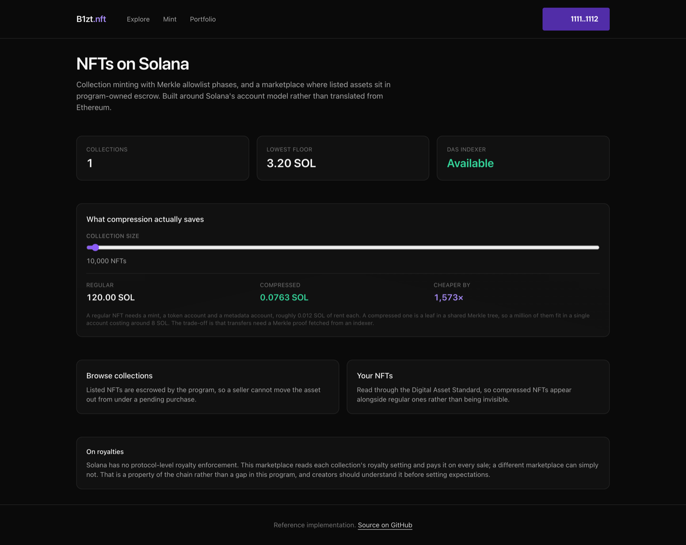
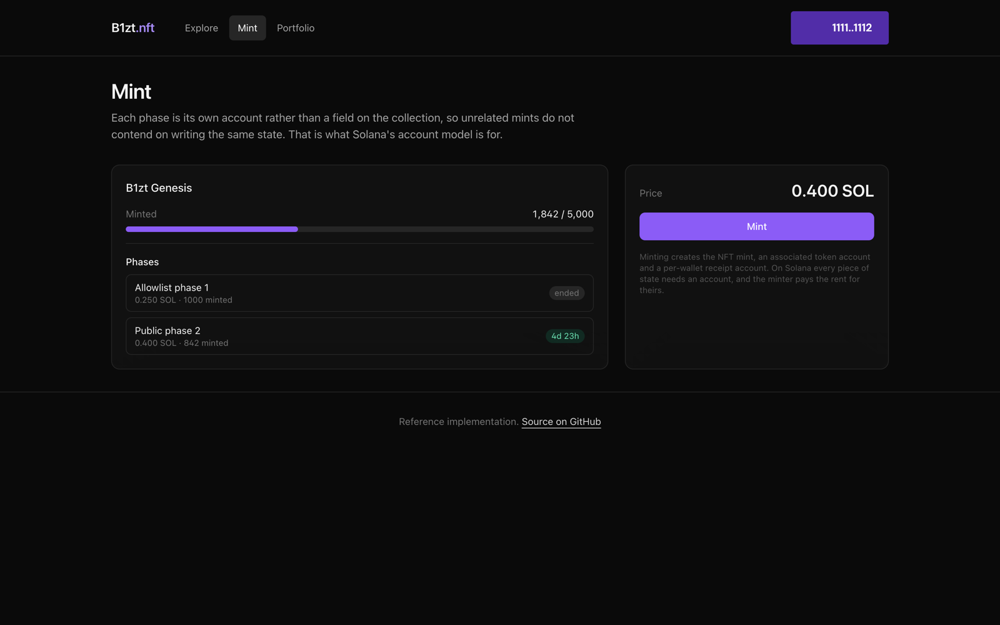
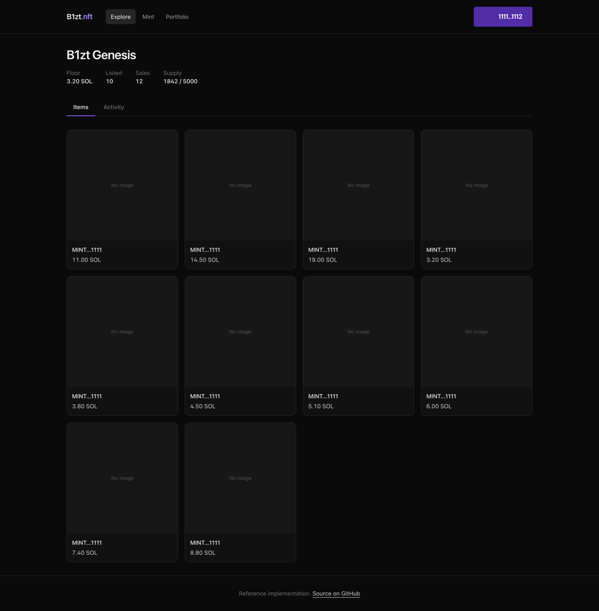
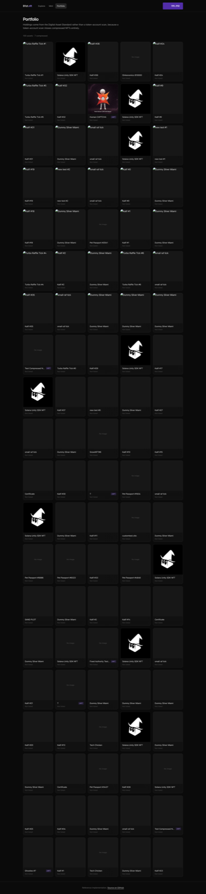

# NFT Marketplace

An NFT platform on Solana: a collection people can mint from in phases, and a marketplace where a
listed NFT is genuinely held in escrow rather than sitting in the seller's wallet behind an approval.

Two Anchor programs in Rust, a TypeScript API that speaks the Digital Asset Standard, and a Next.js
frontend with wallet adapter.



---

## What you can do with it

**Mint from a collection.** Each phase is its own account rather than a field on the collection, so
unrelated mints do not contend on writing the same state. The page shows which phase is live, what
it costs, and how long is left.



**Buy and sell.** Listing moves the token into a program-owned escrow, so a seller cannot sell the
same NFT elsewhere while a purchase is in flight, and a buy cannot land against an empty wallet.



**See your compressed NFTs alongside your regular ones.** Holdings are read through the Digital
Asset Standard, not by scanning token accounts, because a compressed NFT has no account to scan.



The landing page has a live calculator for what compression actually saves. A regular NFT needs a
mint, a token account and a metadata account, roughly 0.012 SOL of rent each. A compressed one is a
leaf in a shared Merkle tree, so a million of them fit in a single account costing around 8 SOL. The
trade-off is that transfers need a Merkle proof fetched from an indexer.

---

## Run it yourself

You will need [Docker](https://docs.docker.com/get-docker/), [Node 20+](https://nodejs.org) and
[pnpm](https://pnpm.io/installation). Building the programs additionally needs the
[Solana toolchain](https://solana.com/docs/intro/installation) and
[Anchor](https://www.anchor-lang.com/docs/installation), but you can run the app without it.

### 1. Start Postgres

```bash
docker compose up -d
```

Postgres lands on port 5437.

### 2. Start the backend

```bash
cd backend
cp .env.example .env
pnpm install
pnpm prisma db push         # create the tables
pnpm db:seed                # a collection, two phases, listings, offers and sales
pnpm dev
```

The defaults point at Solana devnet, which needs no key and no funding. `pnpm db:seed` fills the
tables the indexer would normally build by reading program accounts.

**For compressed NFTs, set `DAS_RPC_URL`.** The public Solana endpoints do not implement the Digital
Asset Standard. Helius, Triton and QuickNode do. Without one the portfolio page says so plainly
rather than failing with an opaque RPC error, which is the most common surprise when wiring this up.

### 3. Start the frontend

```bash
cd ../frontend
cp .env.example .env.local
pnpm install
pnpm dev
```

Open <http://localhost:3000> and connect a Solana wallet.

### 4. Optional: build and deploy the programs

```bash
anchor build                # or: cargo build-sbf
cargo test --workspace      # 20 tests
anchor deploy --provider.cluster devnet
```

Then put the printed program id into both `.env` files and set `INDEXER_ENABLED=true`.

### If something does not work

| Symptom | Cause |
|---|---|
| Pages are empty | You skipped `pnpm db:seed`. `curl localhost:4005/health` should return `{"status":"ok"}`. |
| Portfolio says the RPC does not support DAS | Correct, and expected on a public endpoint. Set `DAS_RPC_URL`. |
| Backend exits at startup | It validates its whole environment at boot and names the variable at fault. |
| `cargo build-sbf` fails but `cargo check` passed | Feature unification across the workspace masks missing features in a single crate. Build each program on its own. |

---

## Written for Solana, not translated from Ethereum

**State is spread across accounts, not packed into one.** Mint phases and per-wallet mint counts are
separate PDAs rather than fields on the collection. A Solana account is fixed-size at creation, so an
inline `Vec<Phase>` would pay rent for its maximum length forever, and every mint in the drop would
contend on writing one account. The EVM twin of this project in the portfolio does the opposite,
because on the EVM it should.

**Account existence replaces boolean flags.** A listing is an account. Delisting closes it. There is
no `isActive` field on-chain to forget to clear, and no state where a listing claims to be active
while the escrow is empty.

**Constraints replace defensive code.** Most of the security lives in `#[derive(Accounts)]`:
`has_one`, `seeds`, `address` and `token::authority` are checked before a handler runs.

**Royalties are a convention, not a guarantee.** Solana has no protocol-level royalty enforcement.
This marketplace reads the collection's royalty setting and pays it on every sale; a different
marketplace can simply not. That is a property of the chain rather than a gap in this program, and
saying so is more useful to a creator than implying they are protected.

---

## Decisions worth explaining

**A second program, written without Anchor, showing what Anchor generates.**
[`escrow_native`](programs/escrow_native/src/lib.rs) is a minimal SOL escrow implemented against the
raw program interface, with a table mapping each Anchor attribute to the code it replaces: `Signer`
to an `is_signer` check, `seeds`/`bump` to `create_program_address` and a comparison,
`Account<'info, T>` to an owner check plus a discriminator check plus a borsh decode, `close` to
moving lamports, zeroing data and reassigning the owner. A developer who has only ever written
Anchor cannot tell which guarantees are the framework's and which are the runtime's. This is that
answer, in 370 lines.

**The off-chain and on-chain allowlists are pinned to each other.** Both build the same five-entry
fixture and assert the same root, in
[`cross_check.rs`](programs/nft_marketplace/tests/cross_check.rs) and
[`allowlist.test.ts`](backend/src/merkle/allowlist.test.ts). When a tree builder and a verifier
disagree the failure is silent and total: the API serves well-formed proofs and every mint fails
with `InvalidProof`. Rust's `to_le_bytes` is little-endian while every EVM codebase is big-endian,
so this is exactly the drift a port introduces.

**One Merkle root can express per-wallet tiers.** The leaf is `keccak(keccak(wallet || allowance_le))`,
so the allowance is bound into the proof. A wallet cannot inflate its own allocation, and the same
phase can grant one wallet 1 mint and another 5 without a second root.

**Holdings are read through DAS rather than by scanning token accounts.** The obvious approach,
enumerate the wallet's token accounts and keep the ones with supply one, misses compressed NFTs
entirely, and compressed NFTs are the reason anyone picks Solana for a large collection.

**Lamports move out of PDAs by direct balance adjustment.** A PDA holding data cannot be the source
of a System program transfer, because the System program refuses to move lamports out of an account
it does not own. Adjusting both balances directly is the supported way, and works only because this
program owns the source account.

**Floor prices are recomputed rather than maintained incrementally.** Incremental is faster and
drifts permanently the moment one update is missed, and a wrong floor price is the most visible
possible bug on a marketplace front page.

---

## Layout

```
programs/
  nft_marketplace/            Collections, phases, listings, offers
    src/instructions/minting.rs   Collection setup, phases, Merkle-gated mint
    src/instructions/trading.rs   List, buy, delist, offer, accept
    tests/logic.rs                Merkle verification and the payment split
    tests/cross_check.rs          The same root the TypeScript tests assert
  escrow_native/              The same escrow idea without Anchor, as a teaching artefact
backend/
  src/chain/das.ts            Digital Asset Standard client, compression cost comparison
  src/indexer/                getProgramAccounts with discriminator filters
  src/merkle/                 Allowlist builder, the TypeScript half of the cross-check
  prisma/seed.ts              Sample data
frontend/                     Mint, collections and portfolio
```

```bash
cargo test --workspace        # 20 Rust tests
cd backend && pnpm test       # 12 TypeScript tests
```

---

## What is not here

The mint page builds and validates the transaction path but does not submit; wiring the final
`sendTransaction` needs a deployed program id and a funded wallet, and a portfolio project that
prompts for a real signature is worse than one that does not.

Compressed minting itself is not implemented. The DAS integration reads compressed assets and the
cost comparison is real, but issuing them requires Bubblegum and a tree the project pays for.
Reading them is the part that changes how the application is built.

This code has not been audited. It is a reference implementation.

---

## License

MIT
