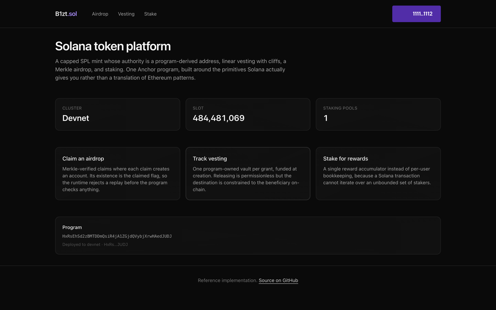

# Solana Smart Contracts

Two full-stack Solana projects, each with Anchor programs in Rust, a backend that indexes program
accounts, and a frontend with wallet adapter.

Rust with Anchor. TypeScript with Fastify, Prisma and @solana/web3.js. Next.js with the Solana
wallet adapter.

---

## [01 - SPL Token Platform](01-spl-token-platform)

A capped SPL mint whose authority is a program-derived address, linear vesting with cliffs, a Merkle
airdrop, and a staking pool with streamed rewards.

[](01-spl-token-platform)

32 Rust tests and 14 TypeScript tests, including three that pin the off-chain Merkle builder to the
on-chain verifier.

---

## [02 - NFT Marketplace](02-nft-marketplace)

Collection minting with Merkle allowlist phases, and a marketplace where a listed NFT is genuinely
held in program-owned escrow.

[](02-nft-marketplace)

Ships a second program, `escrow_native`, written without Anchor, with a table mapping every Anchor
attribute to the code it generates. A developer who has only ever written Anchor cannot tell which
guarantees are the framework's and which are the runtime's; that program is the answer. 20 Rust
tests and 12 TypeScript tests.

---

## Written for Solana, not translated from Ethereum

The most common failure in Solana code from EVM developers is a faithful translation of Ethereum
patterns that the runtime does not reward. Both projects go the other way, and say where and why in
the code:

- **PDAs replace privileged addresses.** A PDA has no private key and can only sign through its own
  program, so there is no equivalent of "the owner key was compromised".
- **Account existence replaces boolean flags.** The runtime refuses to initialise the same address
  twice, so a replayed claim fails before the program checks anything.
- **Accumulators replace iteration.** A transaction touches a bounded set of accounts, so anything
  that loops over participants stops working once there are enough of them.
- **Constraints replace defensive code.** The three classic Solana vulnerabilities are closed
  declaratively in `#[derive(Accounts)]` rather than with runtime `if` statements.

One trap gets its own test in both projects: Rust's `to_le_bytes` is **little-endian** while every
EVM codebase is big-endian. A Merkle tree builder ported across without noticing produces
well-formed proofs that fail every claim, and the on-chain error says only `InvalidProof`.

---

## Running either one

Each project has its own README with a step-by-step setup. The shape is the same:

```bash
cd 01-spl-token-platform        # or 02-nft-marketplace
docker compose up -d            # Postgres
cd backend && pnpm install && pnpm prisma db push && pnpm db:seed && pnpm dev
cd ../frontend && pnpm install && pnpm dev
```

Neither needs a local validator or a deployed program to browse: the backend defaults to devnet for
live chain reads, and `pnpm db:seed` fills the tables an indexer would normally build from program
accounts. Building and deploying the programs is optional and documented in each README.

The two projects use different ports, so you can run both at once.

---

None of this has been audited. It is written to be read.

## License

MIT
